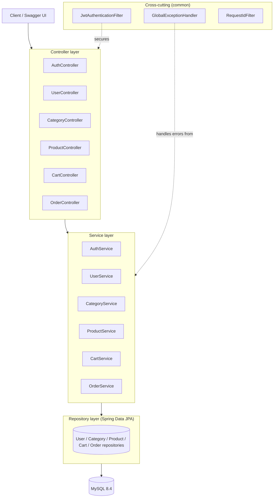
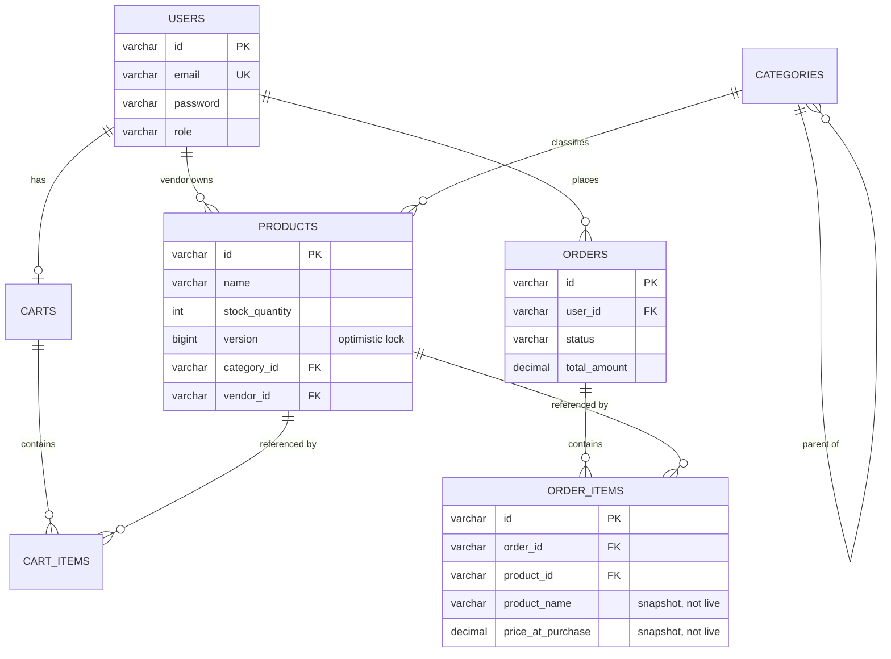

# E-Commerce Marketplace API

[](https://github.com/MayuriGaikwad25/ecommerce-marketplace-api/actions/workflows/ci.yml)

**Live demo:** https://ecommerce-marketplace-api-production.up.railway.app/swagger-ui/index.html

A multi-vendor e-commerce marketplace backend (think a mini Noon.com) built with Spring Boot 3 and Java 21. Vendors list products under a category tree, customers browse, cart, and check out; checkout is stock-safe under concurrent load.

## Highlight: stock-safe checkout under concurrency

The most interesting problem in this codebase: two customers can race to buy the last unit of the same product. `Order.placeOrder` re-reads the product inside a `@Transactional` method and relies on Hibernate dirty-checking plus a `@Version` column (optimistic locking) to decrement stock. Under a real concurrent race, one checkout commits and the other fails at commit time rather than overselling.

This is proven with a real integration test (`OrderConcurrencyIntegrationTest`), not a mock: two threads gated behind `CountDownLatch`es fire simultaneous checkouts against a real Testcontainers MySQL instance, and the test asserts exactly one succeeds, one fails, and final stock is exactly zero.

## Tech stack

| Layer | Choice |
|---|---|
| Language / runtime | Java 21, Spring Boot 3.5.3 |
| Persistence | Spring Data JPA, Hibernate 6, MySQL 8.4, Flyway |
| Security | Spring Security, JWT (stateless), BCrypt |
| API docs | springdoc-openapi (Swagger UI) |
| Testing | JUnit 5, Mockito, Testcontainers |
| Build / infra | Maven, Docker (multi-stage build), GitHub Actions CI |
| Mapping | MapStruct |

## Architecture

Layered architecture per module (`user`, `category`, `product`, `cart`, `order`), each with its own `controller` / `service` / `dto` / `entity` / `repository` package, plus a `common` module for cross-cutting concerns (exception handling, JWT, request-id logging, OpenAPI config).



## Data model



`OrderItem.productName` / `priceAtPurchase` are deliberate snapshots taken at checkout time — an order's history stays accurate even if a product's name or price changes later.

## API overview

All endpoints are prefixed `/api/v1`. Full interactive docs at `/swagger-ui/index.html` once running.

| Module | Endpoints |
|---|---|
| Auth | `POST /auth/register`, `POST /auth/login` |
| Users (admin) | `GET /users`, `POST /users/{id}/promote-to-vendor` |
| Categories | `GET /categories`, `GET /categories/{id}`, `POST /categories` (admin), `PUT /categories/{id}` (admin), `DELETE /categories/{id}` (admin) |
| Products | `GET /products` (filterable/paginated), `GET /products/{id}`, `GET /products/my` (vendor), `POST /products` (vendor), `PUT /products/{id}` (vendor), `DELETE /products/{id}` (vendor) |
| Cart | `GET /cart`, `POST /cart/items`, `PUT /cart/items/{productId}`, `DELETE /cart/items/{productId}` |
| Orders | `POST /orders` (checkout), `GET /orders`, `GET /orders/{id}`, `GET /orders/vendor/items` (vendor), `GET /orders/admin` (admin) |

Roles: `CUSTOMER` (default on registration), `VENDOR` (promoted by an admin), `ADMIN` (seeded on first boot from `ADMIN_SEED_EMAIL`/`ADMIN_SEED_PASSWORD`).

## Running locally

**Prerequisites:** Docker Desktop (that's it — Java/Maven are only needed if you want to run outside Docker).

```bash
git clone https://github.com/MayuriGaikwad25/ecommerce-marketplace-api.git
cd ecommerce-marketplace-api
docker compose up -d
```

This builds the app image and starts both the app and MySQL, wired together on Docker's internal network. The app is published on host port **8082** (8080 was unavailable in this environment; change the `docker-compose.yml` port mapping if you don't have that constraint):

- API: http://localhost:8082/api/v1
- Swagger UI: http://localhost:8082/swagger-ui/index.html
- Health: http://localhost:8082/actuator/health

Default seeded admin: `admin@marketplace.com` / `ChangeMe123!` (override via `ADMIN_SEED_EMAIL`/`ADMIN_SEED_PASSWORD` — required, no default, if running with `SPRING_PROFILES_ACTIVE=prod`).

### Running tests

```bash
./mvnw test
```

Requires Docker running locally (the concurrency test spins up a real MySQL container via Testcontainers). All 7 tests, including the concurrency test, are also run automatically on every push via [GitHub Actions](.github/workflows/ci.yml).

### Sample requests

A ready-to-run Postman collection covering the full golden path (register → login → browse → cart → checkout) is at [`postman/ecommerce-marketplace-api.postman_collection.json`](postman/ecommerce-marketplace-api.postman_collection.json). Import it, set the `baseUrl` variable, and run — the login request auto-captures the JWT into a collection variable for subsequent requests.

## Project structure

```
src/main/java/com/marketplace/
├── common/          # cross-cutting: security, exception handling, logging, OpenAPI config
├── user/            # registration, auth, admin user management
├── category/        # self-referencing category tree
├── product/         # catalog, JPA Specification-based search
├── cart/            # per-user cart
├── order/           # checkout, optimistic-locking concurrency control
└── vendor/          # reserved for a future dedicated vendor-profile feature
```

## Roadmap

- [x] Phase 0-6: architecture, core features, security, hardening, testing
- [x] Phase 7: containerize the app itself (multi-stage Docker build)
- [x] Phase 8: CI (GitHub Actions), secrets hardening for a `prod` profile
- [x] Phase 9: portfolio packaging (this README, ER/architecture diagrams, Postman collection)
- [x] Live deployment (Railway)
- [ ] Microservices split (Spring Cloud: Eureka, Gateway, Config Server, OpenFeign, Resilience4j)
- [ ] Spring AI-powered product search/recommendations
